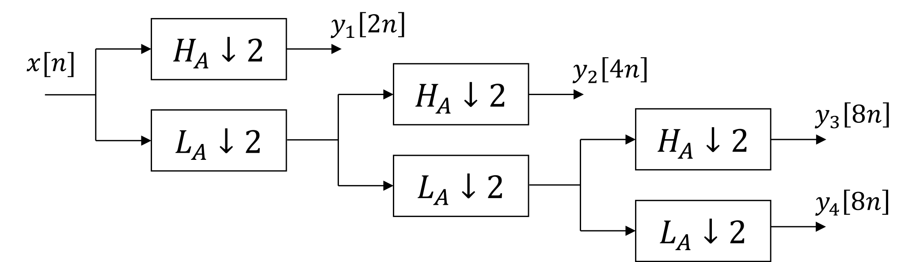
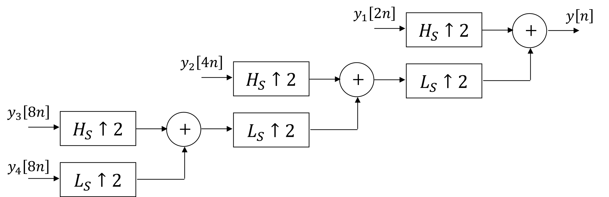

# Dyadic Filterbanks

## Quadrature Mirror Filters

$$ L_{A}[n] = H_{A}[-n] = L_{S}[n] = -H_{S}[-n]  $$

$$ H_{A}[n] = L_{A}[-n] = $$

$$ L_{S}[n] = H_{A}[-n] $$

$$ H_{S}[n] = -L_{A}[-n] $$

## 

[Cohen–Daubechies–Feauveau wavelet][1]
[Daubechies wavelet][2]

[1]:https://en.wikipedia.org/wiki/Cohen–Daubechies–Feauveau_wavelet
[2]:https://en.wikipedia.org/wiki/Daubechies_wavelet