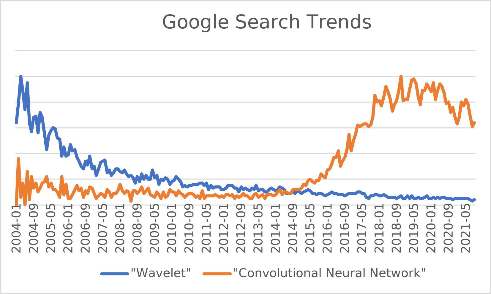
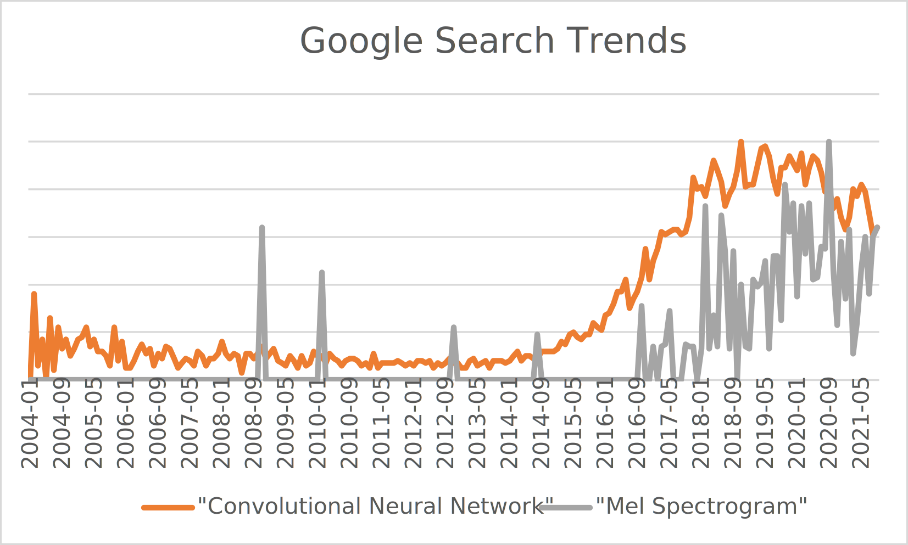

# Team Members

Dan Jacobellis

Utsha Khondkar

# Proposal

The goal of our project is to develop and efficient and parallel implementation for a class of constant-q filterbanks. In particular, we plan to implement the [tunable q factor wavelet transform][2] on the GPU to facilitate it's use in statistical learning problems.

# Background

For audio signal processing problems such as compression, denoising, and various types of pattern recognition, deep learning has taken over. For example, the search interest for "wavelet" has followed the opposite trajectory as "convolutional neural network"

A current trend of audio signal processing research is to apply 2D convolutional neural networks to time-frequency representations of audio. Although great progress was made in the pre-deep learning era on perfect reconstruction filterbanks and wavelet transforms, most of the algorithms and techniques have been abandoned by practitioners of deep learning because no standardized and free implementations were ever widely disseminated. As a result, the standarized set of triangular "Mel" filterbanks dating back nearly 50 years appears to have remained the dominant tool, and have even seen a resurgance despite their [impending obsolescence.][1]

The use of these methods is accumulating a considerable debt. Compared to the most recent iterations of constant-Q filterbanks, these methods for time-frequency analysis lack several desirable properties

* Parameterization/tunability
* Perfect reconstruction
* Meaningful/interpretable phase representation
* Generalization to multiple channels/phased arrays
* Efficient implementation for oversampled representations.

# Goals

In our project, we want explore techniques which offer the same constant-Q spectral decomposition but which address these shortcomings. Specifically, we plan to implement a class of filterbanks introduced in 2011 called the [Tunable Q-factor Wavelet Transform][2]. A resurgence in use of this method is likely to occur due to it's [recent introduction to MATLAB][3]. It's our hope that a freely available, modern GPU implementation would significantly relieve that debt that has accumulated by using older methods, and would provide a great opportunity to learn about parallel algorithms in signal processing.

[1]:https://asmp-eurasipjournals.springeropen.com/articles/10.1186/s13636-021-00217-4
[2]:https://doi.org/10.1109/TSP.2011.2143711
[3]:https://www.mathworks.com/help/wavelet/ref/tqwt.html